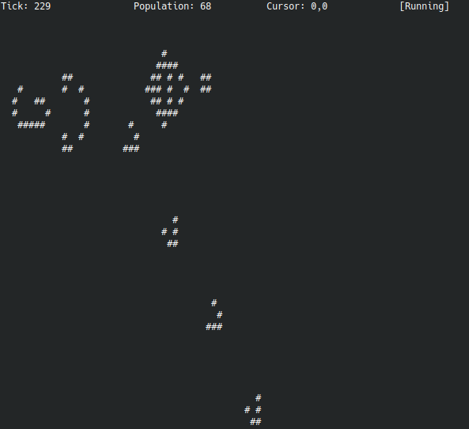

# game-of-life

Conway's Game of Life in Terminal!



## Features:

- play/pause

- 4 level speed adjustment.

- Saving curent pattern to a text file.

- Loading a patten from a text file.

- Live edit mode.


## Prerequisites

1. install git & c/c++ compiler

```bash
$ sudo apt install git build-essential
```

2. install ncurses

```bash
$ sudo apt install libncurses5-dev libncursesw5-dev
```

3. clone the repo

```bash
$ git clone https://github.com/saurabhsingh99100/game-of-life.git
```

4. cd to the cloned repo & compile the program using the povided shell script

```bash
$ cd game-of-life
$ ./compile.sh
```

**Note:** You *may* first need to make compile script executable, this can be done by:

```bash
$ chmod +x compile.sh
```

 

## Instructions

- play/pause at any time using the `p` key.

- quit at any time using `q` key or `ctl+c`.

- Use `1`, `2`, `3`, `4` keys to adjust speed in an inceasing fashion.

- To save currently displayed pattern, press `s` key. Then enter a filename in the prompt that will appear on the top of the scrreen & press `enter`. (Use `-` key for backspace).

- To load a pattern from a file, invoke the program with filename as a command line argument. ex `$ ./gol patterns/glider_gun`.

- To edit the current pattern:
  
  - pause the simulation (using `p` key) & a cursor will appear (marked by symbol `O`). 
  
  - You can move the cursor up, down, left, and right using `i`, `k`, `j`, `l` keys respectively. 
  
  - To toggle the state of a cell (from alive to dead or vice-versa), move the cursor to that cell and use `space` key.


**Have Fun!**
